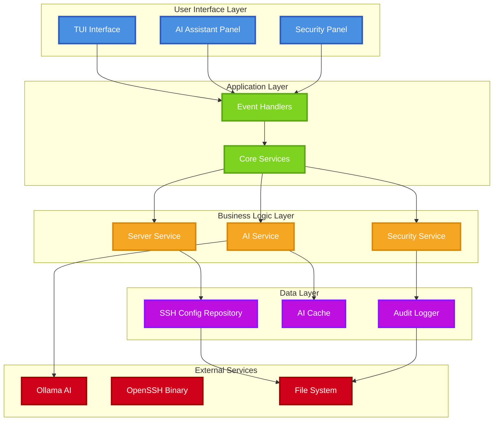
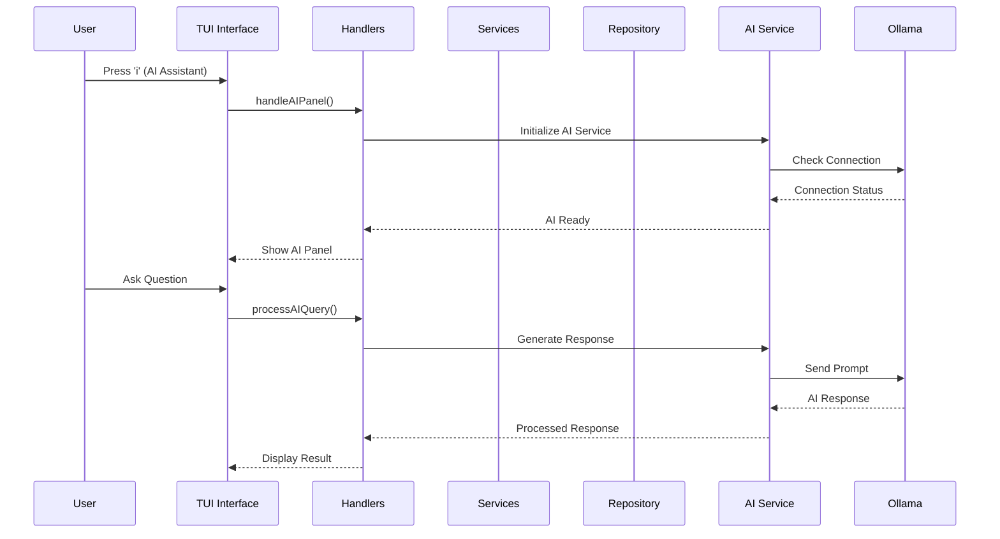
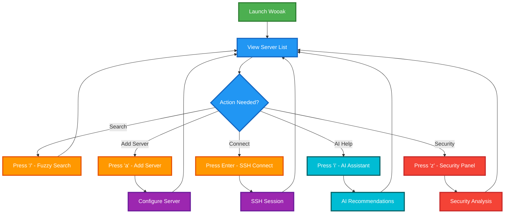
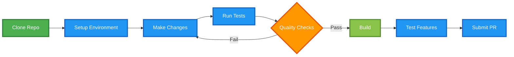
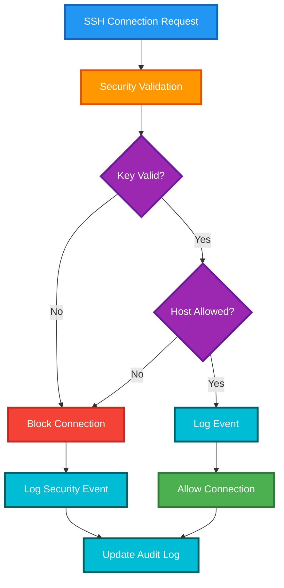

<div align="center">

# Wooak - Intelligent SSH Management

**A modern, AI-powered terminal-based SSH manager with enterprise-grade security**

[](https://golang.org/)
[](LICENSE)
[](https://github.com/aryasoni98/wooak/releases)

</div>

---

## 🚀 Overview

Wooak is a next-generation terminal-based SSH manager that combines the power of modern AI with enterprise-grade security features. Built for developers and system administrators who manage multiple servers, Wooak provides an intuitive interface for SSH server management with intelligent recommendations and comprehensive security analysis.

### 🎯 Key Capabilities

- **🤖 AI-Powered Assistant**: Get intelligent recommendations for SSH configurations
- **🔐 Advanced Security**: Comprehensive security analysis and audit logging
- **⚡ Lightning Fast**: Optimized for speed with intelligent caching
- **🎨 Beautiful UI**: Clean, keyboard-driven interface inspired by k9s and lazydocker
- **🔧 Highly Configurable**: Extensive customization options for every use case

---

## 📋 Table of Contents

- [Quick Start](#-quick-start)
- [Features](#-features)
- [Architecture](#-architecture)
- [Installation](#-installation)
- [Usage Guide](#-usage-guide)
- [Development](#-development)
- [Security](#-security)
- [Contributing](#-contributing)
- [Support](#-support)

---

## ⚡ Quick Start

### 1. Install Wooak

```bash
# Option 1: Homebrew (macOS)
brew install aryasoni98/homebrew-tap/wooak

# Option 2: Download Binary
curl -fsSL https://raw.githubusercontent.com/aryasoni98/wooak/main/install.sh | bash

# Option 3: Build from Source
git clone https://github.com/aryasoni98/wooak.git
cd wooak && make build
```

### 2. Setup AI Assistant (Optional)

```bash
# Install Ollama and AI models
make ai-setup

# Check AI status
make ai-status
```

### 3. Launch Wooak

```bash
wooak
```

### 4. Essential Commands

| Key | Action |
|-----|--------|
| `i` | Open AI Assistant |
| `z` | Open Security Panel |
| `a` | Add new server |
| `Enter` | Connect to server |
| `q` | Quit |

---

## ✨ Features

### 🤖 AI-Powered Intelligence

- **Natural Language Search**: "Find all production web servers"
- **Security Analysis**: AI-powered vulnerability detection
- **Configuration Optimization**: Intelligent performance recommendations
- **Smart Suggestions**: Personalized recommendations based on usage patterns

### 🔐 Enterprise Security

- **SSH Key Validation**: Comprehensive key security analysis
- **Audit Logging**: Complete security event tracking
- **Host Security**: Allow/block list management
- **Policy Enforcement**: Configurable security policies

### 🖥️ Server Management

- **Visual Server List**: Clean, organized server display
- **Fuzzy Search**: Quick server discovery
- **Tagging System**: Organize servers by environment/role
- **Connection Multiplexing**: Faster subsequent connections
- **Port Forwarding**: Local, remote, and dynamic forwarding

### ⚙️ Advanced Configuration

- **Tabbed Interface**: Organized configuration options
- **Auto-completion**: Smart SSH key detection
- **Backup System**: Automatic configuration backups
- **Non-destructive Edits**: Preserves existing formatting

---

## 🏗️ Architecture

### System Architecture



### Data Flow



---

## 📦 Installation

### Prerequisites

- **Go 1.21+** (for building from source)
- **OpenSSH** (for SSH connections)
- **Ollama** (optional, for AI features)

### Installation Methods

#### Option 1: Homebrew (macOS)

```bash
brew install aryasoni98/homebrew-tap/wooak
```

#### Option 2: Download Binary

```bash
# Auto-install script
curl -fsSL https://raw.githubusercontent.com/aryasoni98/wooak/main/install.sh | bash

# Manual download
LATEST_TAG=$(curl -fsSL https://api.github.com/repos/aryasoni98/wooak/releases/latest | jq -r .tag_name)
curl -LJO "https://github.com/aryasoni98/wooak/releases/download/${LATEST_TAG}/wooak_$(uname)_$(uname -m).tar.gz"
tar -xzf wooak_$(uname)_$(uname -m).tar.gz
sudo mv wooak /usr/local/bin/
```

#### Option 3: Build from Source

```bash
git clone https://github.com/aryasoni98/wooak.git
cd wooak
make dev-setup  # Setup development environment
make build      # Build the binary
```

---

## 📖 Usage Guide

### Basic Workflow



### Key Bindings

#### Main Interface

| Key | Action | Description |
|-----|--------|-------------|
| `/` | Search | Toggle fuzzy search bar |
| `↑↓` / `jk` | Navigate | Move through server list |
| `Enter` | Connect | SSH into selected server |
| `a` | Add | Add new server |
| `e` | Edit | Edit selected server |
| `d` | Delete | Delete selected server |
| `p` | Pin | Pin/unpin server |
| `t` | Tags | Edit server tags |
| `s` | Sort | Toggle sort field |
| `S` | Reverse | Reverse sort order |
| `c` | Copy | Copy SSH command |
| `g` | Ping | Ping selected server |
| `r` | Refresh | Refresh server data |
| `i` | AI | Open AI Assistant |
| `z` | Security | Open Security Panel |
| `q` | Quit | Exit application |

#### AI Assistant Panel

| Key | Action | Description |
|-----|--------|-------------|
| `Enter` | Send | Send message to AI |
| `Esc` | Close | Close AI panel |
| `Tab` | Switch | Switch between panels |

#### Security Panel

| Key | Action | Description |
|-----|--------|-------------|
| `Tab` | Navigate | Move between fields |
| `Enter` | Save | Save configuration |
| `Esc` | Close | Close security panel |

### Configuration

Wooak automatically reads from your `~/.ssh/config` file. No additional configuration is required, but you can customize:

- **AI Settings**: Configure AI models and providers
- **Security Policies**: Set security validation rules
- **UI Preferences**: Customize display options

---

## 🛠️ Development

### Development Workflow



### Available Make Targets

```bash
# Development Setup
make dev-setup      # Setup complete development environment
make tools          # Install development tools
make deps           # Download dependencies

# Building
make build          # Build binary with quality checks
make build-all      # Build for all platforms
make run            # Run from source
make demo           # Run demo with sample data

# Quality Assurance
make quality        # Run all quality checks
make test           # Run unit tests
make coverage       # Generate coverage report
make lint           # Run linter
make security-scan  # Run security checks

# AI Features
make ai-setup       # Setup AI dependencies
make ai-status      # Check AI service status
make ai-models      # List available AI models
make ai-test        # Test AI functionality

# Security Features
make security-test  # Test security features
make security-scan  # Run security analysis

# Maintenance
make clean          # Clean build artifacts
make update-deps    # Update dependencies
make help           # Show all available targets
```

### Project Structure

```
wooak/
├── cmd/                    # Application entry point
│   └── main.go
├── internal/               # Private application code
│   ├── adapters/          # External interface adapters
│   │   ├── data/          # Data layer adapters
│   │   └── ui/            # User interface adapters
│   │       ├── ai/        # AI UI components
│   │       └── security/  # Security UI components
│   ├── core/              # Business logic
│   │   ├── domain/        # Domain models
│   │   │   ├── ai/        # AI domain models
│   │   │   └── security/  # Security domain models
│   │   ├── ports/         # Interface definitions
│   │   └── services/      # Business services
│   │       ├── ai/        # AI services
│   │       └── security/  # Security services
│   └── logger/            # Logging utilities
├── docs/                  # Documentation and screenshots
├── makefile              # Build automation
├── .goreleaser.yaml      # Release configuration
└── README.md             # This file
```

### Adding New Features

1. **Create Domain Models** (if needed)
2. **Implement Services** in `internal/core/services/`
3. **Add UI Components** in `internal/adapters/ui/`
4. **Update Handlers** in `internal/adapters/ui/handlers.go`
5. **Add Tests** and ensure quality checks pass
6. **Update Documentation**

### Testing

```bash
# Run all tests
make test

# Run tests with coverage
make coverage

# Run specific test packages
go test ./internal/core/services/...

# Run benchmarks
make benchmark
```

---

## 🔐 Security

### Security Features

Wooak implements multiple layers of security:

#### 1. SSH Key Validation
- Validates key types and sizes
- Checks for weak or deprecated algorithms
- Provides security recommendations

#### 2. Audit Logging
- Tracks all security-relevant events
- Configurable retention policies
- Structured logging for analysis

#### 3. Host Security
- Allow/block list management
- Connection validation
- Security policy enforcement

#### 4. Configuration Safety
- Non-destructive configuration edits
- Automatic backups before changes
- Atomic file operations

### Security Workflow



### Security Best Practices

1. **Regular Key Rotation**: Use AI recommendations for key management
2. **Monitor Audit Logs**: Review security events regularly
3. **Update Security Policies**: Keep policies current with best practices
4. **Use Strong Keys**: Prefer Ed25519 over RSA when possible
5. **Enable Host Verification**: Always verify host keys

---

## 🤝 Contributing

We welcome contributions! Please follow these guidelines:

### Development Process


### Pull Request Guidelines

1. **Use Semantic PR Titles**:
   - `feat(scope): description` - New features
   - `fix(scope): description` - Bug fixes
   - `improve(scope): description` - Improvements
   - `docs: description` - Documentation

2. **Ensure Quality**:
   ```bash
   make quality  # Run all quality checks
   make test     # Run tests
   ```

3. **Update Documentation**:
   - Update README if needed
   - Add/update code comments
   - Update help text

### Available Scopes

- `ui` - User interface changes
- `ai` - AI-related features
- `security` - Security features
- `config` - Configuration handling
- `parser` - SSH config parsing

### Examples

```bash
feat(ai): add natural language search
fix(security): resolve key validation edge case
improve(ui): enhance server list performance
docs: update installation instructions
```

---

## ⭐ Support

If you find Wooak useful, please consider:

- ⭐ **Starring** the repository
- 🐛 **Reporting** bugs via issues
- 💡 **Suggesting** new features
- 🤝 **Contributing** code improvements

### Community

- 📧 **Issues**: [GitHub Issues](https://github.com/aryasoni98/wooak/issues)
- 💬 **Discussions**: [GitHub Discussions](https://github.com/aryasoni98/wooak/discussions)

---

## 🙏 Acknowledgments

- Built with [tview](https://github.com/rivo/tview) and [tcell](https://github.com/gdamore/tcell)
- Inspired by [k9s](https://github.com/derailed/k9s) and [lazydocker](https://github.com/jesseduffield/lazydocker)
- AI powered by [Ollama](https://ollama.ai/)

---

<div align="center">

**Made with ❤️ for the developer community**

[⬆ Back to Top](#-overview)

</div>